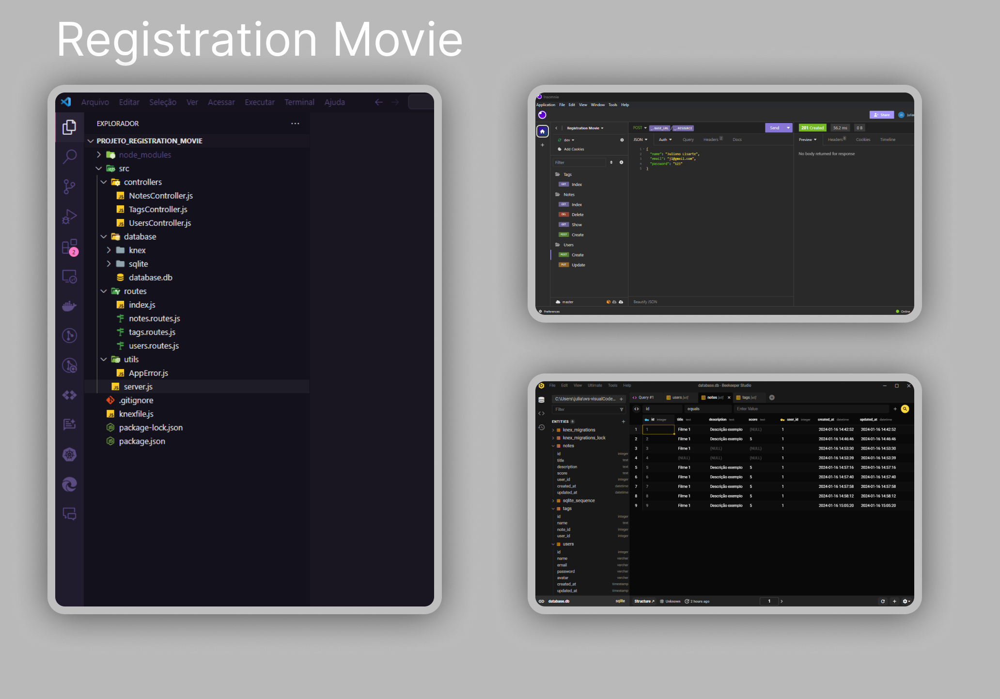

  

<h1 align="center">Registration Movie - Projeto do Explorer - Rocketseat</h1>

 

  
  <a href="https://jlisarte.github.io/projeto_registration_movie/" target="_blank">https://jlisarte.github.io/projeto_registration_movie/</a>

## 🚀 Tecnologias

Esse projeto foi desenvolvido com as seguintes tecnologias:

- Node.js
- Insomnia
- Beekeeper Studio

## 💻 Projeto

Registration Movie  
O projeto é uma aplicação em Node.js onde o usuário cadastra um filme, preenche com algumas informações (nome, descrição, nota) e cria tags relacionadas a ele.  
O que foi abordado nesse projeto:

- API;
- Node_modules;
- Rotas;
- Controllers;
- App Error;
- Banco de dados, tabelas e manipulando os dados;
- Criptografia de senha;
- Atualizar, deletar, listar dados das tabelas;
- Validando e-mail;
- Primary key e Foreign key;
- Cardinalidade;

Projeto do Explorer - Rocketseat

---

Feito por Shadowkhan - Juliano Lisarte
